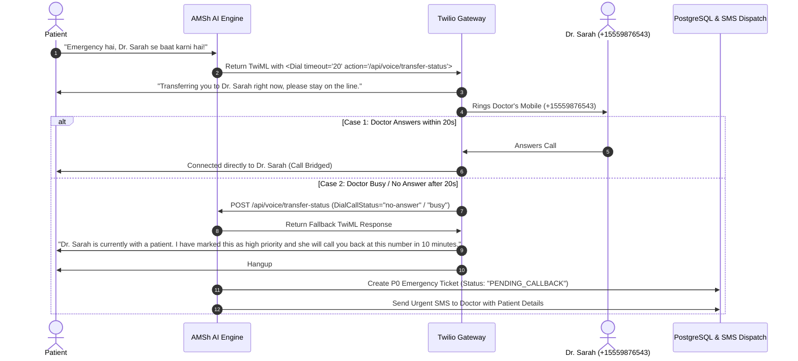

# AMSh — Telephony, Call Forwarding & Human Transfer Architecture

This document provides the complete architectural specification and engineering blueprints for **Telephony Ingestion**, **Call Forwarding (*72)**, **Human Doctor/Staff Escalation (Warm vs. Cold Transfer)**, and the **Zero-Dropped-Calls 20-Second Fallback Engine**.

---

## 1. 📞 Telephony Ingestion Strategies

AMSh supports two distinct onboarding paths for clinic phone numbers so businesses can go live without losing their existing business identity or paying exorbitant porting fees:

```
                            ┌──────────────────────────────────────────────────────────────┐
                            │                 Inbound Caller (Patient)                     │
                            └──────────────────────────────┬───────────────────────────────┘
                                                           │
                                ┌──────────────────────────┴──────────────────────────┐
                                │                                                     │
                                ▼                                                     ▼
                ┌───────────────────────────────┐                     ┌───────────────────────────────┐
                │   Path A: Dedicated AI Line   │                     │  Path B: Call Forwarding (*72)│
                ├───────────────────────────────┤                     ├───────────────────────────────┤
                │ Patient dials Twilio DID      │                     │ Patient dials Existing Clinic │
                │ e.g., +1 (415) 800-AMSH       │                     │ e.g., +1 (555) 019-2834       │
                └───────────────┬───────────────┘                     └───────────────┬───────────────┘
                                │                                                     │
                                │                                                     ▼ (Forwarded via Carrier)
                                │                                     ┌───────────────────────────────┐
                                │                                     │ Twilio Dedicated Trunk        │
                                │                                     │ From: +1 (Caller)             │
                                │                                     │ ForwardedFrom: +1 (Clinic)    │
                                └───────────────────────┬─────────────┴───────────────────────────────┘
                                                        │
                                                        ▼
                                      ┌───────────────────────────────────┐
                                      │   AMSh Voice Gateway (FastAPI)    │
                                      │   WSS Media Stream / TwiML Router │
                                      └───────────────────────────────────┘
```

### Path A: Dedicated Twilio AI Number (Direct Inbound)
- **Use Case:** New clinics, branch offices, or dedicated after-hours triage numbers.
- **Workflow:** Tenant selects a local or toll-free number during `/onboarding/integrations`. AMSh provisions the Twilio number and attaches webhooks:
  - `VoiceUrl`: `https://api.amsh.ai/api/voice/incoming`
  - `StatusCallback`: `https://api.amsh.ai/api/voice/status`

### Path B: Existing Clinic Number via Call Forwarding (`*72`)
- **Use Case:** Established clinics who want to keep their existing phone number published on Google Maps and business cards.
- **Workflow:**
  1. AMSh allocates a background virtual forwarding line (Twilio DID).
  2. Clinic dials `*72 [Twilio-Number]` on their landline/carrier (AT&T, Verizon, Comcast Business) to activate unconditional forwarding, or `*71` for busy/unanswered forwarding.
  3. **Caller ID Preservation:** When the carrier forwards the call, Twilio includes SIP headers:
     - `From`: Original patient's mobile number (e.g. `+1-555-111-2222`).
     - `ForwardedFrom`: Clinic's official line (e.g. `+1-555-999-0000`).
  4. AMSh looks up the clinic by `ForwardedFrom` and greets the patient with their personalized clinic name.

---

## 2. 🚨 Flaw 4: Human Doctor/Staff Call Transfer Architecture

In voice AI systems, patient escalations (e.g., *"Emergency hai, mujhe Dr. Sarah se abhi baat karni hai"*, or acute pain reporting) must be routed to human staff with **100% deterministic reliability**.

### Transfer Types: Cold vs. Warm Transfer

| Dimension | Cold Transfer (MVP Standard) | Warm Transfer (Configurable / Phase 2) |
|---|---|---|
| **Mechanism** | Instant direct `<Dial>` to doctor's phone. | AI puts patient on hold, calls doctor first, whispers patient context, then bridges. |
| **Latency** | Immediate (~500ms). | ~15–30 seconds for doctor briefing. |
| **Complexity** | Minimal (TwiML `<Dial>` + Action webhook). | High (Twilio Conference / Multi-leg call). |
| **Priority** | **P0 (Implemented in MVP)** | **Option / Configurable for later upgrade** |

---

## 3. 🛡️ The 20-Second Fallback & Zero-Dropped-Calls Engine

### The Problem:
If an AI transfers an emergency call to a doctor who is currently in surgery or with a patient, traditional phone systems ring indefinitely or dump the caller into a generic voicemail, resulting in a dropped call and patient frustration.

### The AMSh Solution:
AMSh uses a **deterministic 20-second timeout with automated TwiML fallback and SMS alert dispatch**.



---

## 4. 💻 Technical Implementation Blueprints

### 1. AI Engine Transfer Tool (`backend/ai/tools/transfer_call.py`)
When caller intent triggers human transfer or safety guardrail escalates:

```python
from backend.ai.tools.framework.base import BaseTool, ToolResult

class TransferCallTool(BaseTool):
    name = "transfer_call"
    description = "Transfer the call to human staff or doctor"

    async def execute(self, phone_number: str, staff_name: str = "Staff", reason: str = "") -> ToolResult:
        twiml_response = f"""<?xml version="1.0" encoding="UTF-8"?>
<Response>
    <Say voice="Polly.Joanna">Transferring you to {staff_name} right now, please stay on the line.</Say>
    <Dial timeout="20" record="record-from-answer" action="/api/voice/transfer-status?staff={staff_name}">
        {phone_number}
    </Dial>
</Response>"""
        return ToolResult(
            success=True,
            data={"twiml": twiml_response, "transfer_phone": phone_number, "staff_name": staff_name, "reason": reason}
        )
```

### 2. Twilio Transfer Status Callback Handler (`backend/server/api/routes/voice.py`)
```python
from fastapi import APIRouter, Form, Query, Response
from backend.server.database.session import get_db
from backend.server.services.sms import send_sms_alert

router = APIRouter(prefix="/api/voice", tags=["Voice Telephony"])

@router.post("/transfer-status")
async def handle_transfer_status(
    DialCallStatus: str = Form(...),
    From: str = Form(...),
    CallSid: str = Form(...),
    staff: str = Query("Staff")
):
    """
    Called by Twilio when the <Dial> execution completes or times out after 20s.
    DialCallStatus values: 'completed', 'busy', 'no-answer', 'failed', 'canceled'
    """
    if DialCallStatus == "completed":
        # Call was successfully answered by the doctor
        return Response(content="<Response></Response>", media_type="application/xml")

    # Fallback: Doctor did not answer or was busy
    fallback_twiml = f"""<?xml version="1.0" encoding="UTF-8"?>
<Response>
    <Say voice="Polly.Joanna">
        {staff} is currently with a patient. I have marked this as high priority, and she will call you back at this number in 10 minutes.
    </Say>
    <Hangup/>
</Response>"""

    # Trigger P0 High-Priority SMS to the Doctor
    await send_sms_alert(
        recipient_phone=staff_phone,
        message=f"[AMSH P0 ALERT] Urgent callback requested by {From}. Reason: Emergency / Transfer unanswered. Patient promised callback in 10 min."
    )

    return Response(content=fallback_twiml, media_type="application/xml")
```

---

## 5. 🔮 Optional Warm Transfer Flow (Phase 2 Roadmap)

For premium tier subscriptions or surgical specialty clinics requiring pre-briefing:

1. **Step 1:** AI puts patient into a dynamic private Twilio Conference room with pleasant hold music.
2. **Step 2:** Twilio REST API dials Dr. Sarah's phone.
3. **Step 3:** When Dr. Sarah answers, Twilio whispers an automated briefing:
   > *"Dr. Sarah, this is AMSH AI. You have an urgent incoming transfer from patient Michael Brown reporting severe post-op bleeding. Press 1 to accept or 2 to send to emergency queue."*
4. **Step 4:** If Dr. Sarah presses `1`, Twilio joins both call legs into the conference. If `2` or no input within 15 seconds, the AI executes the polite callback promise to the patient.

> [!NOTE]
> Warm Transfer is treated as a secondary configurable option so MVP delivery remains ultra-fast, robust, and dependable.

---

## 6. 🌐 Live Browser WebRTC Testing ("Try It Yourself")

To ensure tenants don't need a live phone call to test their receptionist during onboarding:
- `frontend/user` embeds a **WebRTC Audio Test Console**.
- Browser requests microphone permission and connects directly to `wss://api.amsh.ai/ws/voice/stream/test`.
- Clinic owners can simulate booking appointments, asking pricing FAQs, and testing emergency escalations live with zero telecom charges.
