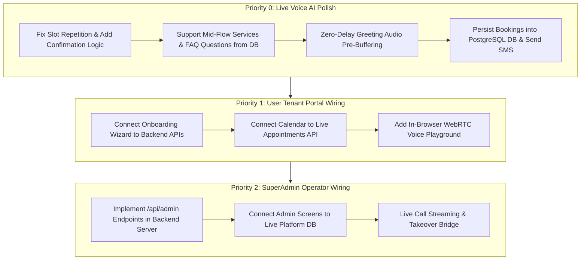

# AMSh Multi-Module Status & Live Progress Tracker

This document provides a single source of truth for tracking what is **Completed (Done)**, what is **Currently In-Progress**, and what is **Pending / Blocked (Atka hua)** across all 4 core components of the AMSh platform:
1. **Backend Server (`backend/server/`)**
2. **Backend AI / Voice Engine (`backend/ai/`)**
3. **Frontend User / Tenant Dashboard (`frontend/user/`)**
4. **Frontend Admin / SuperAdmin Portal (`frontend/admin/`)**

---

## High-Level Platform Architecture Summary

```
                  ┌─────────────────────────────────────────────────────────┐
                  │                 INBOUND CALL / TELEPHONY                │
                  │   Exotel (+91 India DIDs)  │  Twilio (+1 Global DIDs)   │
                  └────────────────────────────┬────────────────────────────┘
                                               │
                                               ▼
┌────────────────────────────────────────────────────────────────────────────────────────┐
│                        PILLAR 4: BACKEND AI CONVERSATION ENGINE                        │
│                                                                                        │
│   ┌─────────────────────┐      ┌─────────────────────┐      ┌──────────────────────┐   │
│   │    Deepgram STT     │ ───► │  State Machine LLM  │ ───► │     Cartesia TTS     │   │
│   │ (Nova-2 en-IN / Dig)│      │  (Groq GPT-OSS-20B) │      │ (Sonic-3 8kHz PCM)   │   │
│   └─────────────────────┘      └──────────┬──────────┘      └──────────────────────┘   │
│                                           │                                            │
│                                ┌──────────┴──────────┐                                 │
│                                │   Tools & Registry  │ (Book Appointment, Send SMS)    │
│                                └──────────┬──────────┘                                 │
└───────────────────────────────────────────┼────────────────────────────────────────────┘
                                            │
                                            ▼
┌────────────────────────────────────────────────────────────────────────────────────────┐
│                         PILLAR 3: BACKEND BUSINESS SERVER                              │
│                                                                                        │
│   FastAPI REST API (`/api/auth`, `/api/businesses`, `/api/appointments`, `/api/voice`)  │
│   PostgreSQL 16 Multi-Tenant DB ─── Redis 7 State & Session Store                      │
└───────────────────────┬────────────────────────────────────────────┬───────────────────┘
                        │                                            │
                        ▼                                            ▼
┌──────────────────────────────────────────────┐ ┌───────────────────────────────────────┐
│     PILLAR 1: FRONTEND USER (TENANT PORTAL)  │ │   PILLAR 2: FRONTEND ADMIN (OPERATOR) │
│                                              │ │                                       │
│ • Next.js 14 Dashboard                       │ │ • SuperAdmin Control Panel            │
│ • 8-Step Onboarding Wizard                   │ │ • Live Call Inspector & Waveform      │
│ • Calendar Appointments & CRM                │ │ • Tenant Management & Platform Health │
│ • AI Receptionist Config & Playground        │ │ • Global Audit Logs & Analytics       │
└──────────────────────────────────────────────┘ └───────────────────────────────────────┘
```

---

## Detailed Component Matrix

### 1. Backend Server (`backend/server/`)

| Area | Feature / Task | Status | Details / Location |
|---|---|---|---|
| **Architecture** | Decoupled Modular Server |  **DONE** | `backend/server/` contains `api/`, `database/`, `auth/`, `billing/`, `workers/`. |
| **Auth** | JWT + Bcrypt Auth System |  **DONE** | `POST /api/auth/register`, `/login`, `/me`, `/accept-invite`. |
| **Database** | PostgreSQL Models |  **DONE** | `Business`, `User`, `Staff`, `Service`, `Agent`, `KnowledgeDocument`, `Integration`, `Call`, `Message`, `Transaction`, `Usage`, `PhoneNumber`. |
| **Onboarding** | Step-by-Step Onboarding API |  **DONE** | `/api/businesses/{id}/services`, `/staff`, `/agents`, `/knowledge`, `/integrations`. Validated with curl. |
| **RAG Knowledge** | Document Upload & Site Sync |  **DONE** | `POST /upload-file` (PDF/DOCX/TXT), `POST /sync-url` (HTML scraper), `POST /query` (sub-50ms RAG search). |
| **Security/Crypto**| Cryptography & PII Masking |  **DONE** | `CryptoManager` Fernet AES-256 / RSA encryption & `mask_phone` PII masking in server logs (`backend/server/auth/crypto.py`). |
| **WhatsApp Webhook**| Meta WhatsApp Cloud API |  **DONE** | `GET/POST /api/v1/whatsapp/webhook` verification & inbound webhook handler in `integrations.py`. |
| **Telephony Route**| Exotel Inbound Webhook |  **DONE** | `/api/voice/exotel/incoming`, `/api/voice/exotel/status` returning dynamic JSON for Exotel Voicebot Applet. |
| **Schema Upgrade** | Agents Table Extended |  **DONE** | Added `primary_language`, `languages`, `greeting_message`, `config` columns to DB. |
| **Appointments** | Bookings / Transactions API | ⏳ **PENDING** | Need dedicated `/api/businesses/{id}/appointments` CRUD with slot filtering and calendar view sync. |
| **Admin API** | SuperAdmin Management API | ⏳ **PENDING** | Route `/api/admin` scaffolded; tenant suspension, global usage, and audit log endpoints need business logic. |
| **Phone Numbers** | Provider Number Provisioning | ⏳ **PENDING** | API to link Exotel/Twilio numbers to business tenants with carrier forwarding instructions. |
| **Post-Call Hook** | Automated Owner Notifications | ⏳ **PENDING** | Background worker dispatching SMS / Email summary to clinic staff when a call completes. |

---

### 2. Backend AI / Conversation Engine (`backend/ai/`)

| Area | Feature / Task | Status | Details / Location |
|---|---|---|---|
| **RAG Architecture**| Sub-50ms Vector Retriever |  **DONE** | `backend/ai/engine/rag/` (`chunker.py`, `vector_store.py`, `retriever.py`). Benchmarked at 0.06ms-0.1ms vector query latency. |
| **Telephony Gateway** | Exotel WebSocket Adapter (India) |  **DONE** | PCM16 @ 8kHz (320-byte chunks) streaming live on virtual number `08047284627`. |
| **Telephony Gateway** | Twilio WebSocket Adapter (Global)|  **DONE** | $\mu$-law @ 8kHz (160-byte chunks) streaming on `+16562547488`. |
| **Speech-to-Text** | Deepgram Nova-2 Live Stream |  **DONE** | Streaming STT with `language=en-IN` and number-word to digit normalizer (`eight nine...` $\rightarrow$ `8901414107`). |
| **Text-to-Speech** | Cartesia Sonic-3 Streaming TTS |  **DONE** | Cartesia Sonic-3 voice `a631bc8b...` with explicit 8kHz PCM frames. Audio distortion ("guhchub puchu") resolved. |
| **LLM Inference** | Groq Fast LLM (`gpt-oss-20b`) |  **DONE** | Sub-200ms latency inference for conversation turns and slot extraction. |
| **State Machine** | Multi-Turn Appointment Flow |  **DONE** | Deterministic slot collection (`name`, `phone`, `service`, `datetime`, `staff`). |
| **Safety Guardrails**| Zero-Latency Emergency Trigger |  **DONE** | Immediate human transfer on medical emergency ("chest pain", "bleeding"). |
| **Vertical Loader**| Dynamic Config System |  **DONE** | YAML configs for `clinic.yaml` and `restaurant.yaml` without hardcoding business rules. |
| **Tools Registry** | Smart SMS Dispatch Tool |  **DONE** | `backend/ai/tools/common/send_sms.py` routes `+91` numbers via Exotel and international via Twilio. |
| **Conversation UX**| **Slot Confirmation & Repetition** | ⚠️ **ATKA HUA (FIX IN PROGRESS)** | During live call, AI repeated questions (name/phone) if speech had background noise or extra phrasing. Needs explicit slot verification state. |
| **Conversation UX**| **In-Flow FAQ / Services Answering** | ⚠️ **ATKA HUA (FIX IN PROGRESS)** | If caller asks "konsi services dete ho" during booking, AI must answer from DB service catalog before resuming slot collection. |
| **Audio Latency** | **Greeting Pre-Buffering** | ⚠️ **ATKA HUA (FIX IN PROGRESS)** | Greeting audio has ~1.5-2.5s delay. Need pre-buffering (<100ms) welcome audio frames. |
| **Interruption** | Barge-In / VAD Sensitivity | ⏳ **PENDING** | Tuning VAD thresholds for instant audio cancellation when user speaks over the AI. |
| **Persistence** | PostgreSQL DB Booking Hook | ⏳ **PENDING** | Ensure `book_appointment` tool persists confirmed row directly into `appointments`/`transactions` DB table. |

---

### 3. Frontend User / Tenant Portal (`frontend/user/`)

| Area | Feature / Task | Status | Details / Location |
|---|---|---|---|
| **Design System** | Clean Modern Layout |  **DONE** | Next.js 14, Tailwind CSS, Plus Jakarta Sans typography, light theme with dark accents. |
| **Onboarding** | 8-Step Wizard Flow |  **DONE** | Business Info, Services, Staff, Hours, AI Receptionist, Knowledge Base, Integrations, Review. |
| **Terminology** | Multi-Vertical String Dictionary |  **DONE** | `utils/strings/en.ts` dynamically maps terminology (Doctor vs. Stylist vs. Table). |
| **Dashboard** | Core Tenant Views |  **DONE** | Dashboard KPIs, Appointments Calendar, Call History, Customer CRM, Settings. |
| **Playground** | Interactive AI Test Playground |  **DONE** | `TestPlaygroundModal.tsx` supports scripted testing, free chat, and simulated call flow. |
| **Compilation** | TypeScript Health |  **DONE** | 0 TypeScript errors platform-wide. |
| **API Wiring** | Live Backend Connection | ⏳ **PENDING** | Connect Onboarding and Dashboard data fetching to real FastAPI backend endpoints. |
| **Live Playground**| WebRTC In-Browser Audio Call | ⏳ **PENDING** | Stream browser microphone directly to `/api/voice` WebSocket for live testing without a phone call. |
| **Realtime Alert** | Inbound Call Toast / Popup | ⏳ **PENDING** | Real-time WebSocket indicator showing active live call on the tenant dashboard. |

---

### 4. Frontend Admin / SuperAdmin Portal (`frontend/admin/`)

| Area | Feature / Task | Status | Details / Location |
|---|---|---|---|
| **Screens** | 20+ SuperAdmin Screens |  **DONE** | Dashboard, Businesses, Business Details (12 tabs), Users, Calls, Conversations, Appointments, Customers, Services, Health, Audit, Billing. |
| **UI Polish** | Standardized UI Compaction |  **DONE** | Standard headers (`text-lg font-bold`), clean stat cards, SVG icons, compact tables. |
| **Call Inspector** | Waveform Player & Transcript |  **DONE** | Multi-bar waveform audio player and per-turn sentiment transcript viewer. |
| **Navigation** | Full Bidirectional Routing |  **DONE** | Complete cross-navigation between businesses, calls, users, and audit logs. |
| **API Wiring** | Live Admin Backend Wiring | ⏳ **PENDING** | Hook admin tables and tenant management actions to `/api/admin/*` APIs. |
| **Live Takeover** | SuperAdmin Live Listen & Takeover| ⏳ **PENDING** | WebSocket bridge allowing platform operator to listen into live calls and take over audio stream. |
| **System Health** | Real Telemetry & Health Metrics | ⏳ **PENDING** | Live CPU/Memory/Active Calls telemetry from Redis and Docker containers. |

---

## Active Work Order & Immediate Next Steps



---

## Quick Reference Commands

- **Run Backend API Server (Docker)**:
  ```powershell
  docker compose up -d
  ```
- **Check Backend Logs**:
  ```powershell
  docker logs -f saas-api-1
  ```
- **Run Frontend User Portal**:
  ```powershell
  cd frontend/user; npm run dev -- -p 3000
  ```
- **Run Frontend Admin Portal**:
  ```powershell
  cd frontend/admin; npm run dev -- -p 3001
  ```
