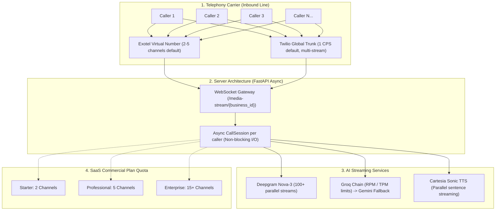

# 27. AMSh Call Concurrency & Scaling Roadmap (Post-MVP)

**Document ID:** `DOCS/27_AMSh_Call_Concurrency_and_Scaling_Roadmap.md`  
**Status:** `PLANNED (POST-MVP)`  
**Scope:** Architecture, limits, carrier channels, AI capacity, and high-concurrency scaling strategy.  
**Decision:** Keep MVP focused on core single/low-concurrency operations (1-3 concurrent calls per clinic); schedule enterprise multi-channel concurrency for post-MVP phase.

---

## 1. Executive Summary & MVP vs Future Split

When a virtual number receives multiple inbound calls at the exact same second, how many callers can talk to the AI simultaneously without hearing a busy tone or dropping?

In the AMSh architecture, **concurrency is not a single number**—it is bounded by four distinct tiers:
1. **Carrier/Telephony Trunk** (Exotel channels or Twilio CPS)
2. **Server Async I/O** (FastAPI WebSocket sessions)
3. **AI Pipeline Throughput** (Deepgram STT, Groq/Gemini LLM RPM/TPM, Cartesia TTS)
4. **SaaS Commercial Quotas** (Plan limits: Starter 2, Pro 5, Enterprise 15)

### Strategic Decision: Defer Heavy Concurrency to Post-MVP

| Aspect | MVP Reality (Current) | Future Plan (Post-MVP Enterprise) |
|---|---|---|
| **Typical Clinic Concurrency** | 1 to 2 concurrent calls (handles 95% of clinic traffic) | 10 to 100+ concurrent calls (hospitals, multi-location clinics) |
| **Exotel Channels** | Standard pilot number (2-5 channels) | Multi-channel PRI / SIP trunking (15-50+ channels) |
| **Twilio Capacity** | 1 CPS default, standard pay-as-you-go | Elastic SIP trunking with 10+ CPS reserved throughput |
| **AI LLM Tier** | Groq developer tier + Gemini fallback | Groq / Gemini Enterprise provisioned throughput |
| **Limit Enforcement** | Soft reporting in dashboard (`ENFORCE_VOICE_QUOTA=false`) | Hard Redis-based active channel limiter + hold queue |
| **Infrastructure** | Single FastAPI container running WebSockets + REST | Dedicated horizontally autoscaled Voice Media Gateway pods |

---

## 2. The 4 Layers of Concurrency Limits



---

### Layer 1: Virtual Number & Carrier Channels

The physical phone number dialled by the patient is the first gatekeeper:

#### A. Exotel (India Virtual Numbers - DID / VNPs)
* **How it works:** In India, virtual numbers operate on virtual PRI channels.
* **Default Capacity:** A standard Exotel virtual number typically comes with **2 to 5 channels**.
* **Behavior when full:** If a number has 5 channels and a 6th patient dials, the carrier gives a **busy tone** or plays Exotel's default waiting IVR before ever reaching the AMSh server.
* **How to scale:** Exotel allows purchasing additional channels (e.g., adding 10, 20, or 50 channels to the existing virtual number) without changing the phone number.

#### B. Twilio (Global Numbers)
* **How it works:** Twilio numbers do not have rigid channel caps for inbound voice; Twilio accepts multiple concurrent calls by default.
* **Default Capacity:** Governed by **CPS (Calls Per Second)**. Standard accounts have **1 CPS** (can receive 1 new incoming call burst every second).
* **Behavior when full:** Concurrent calls already talking remain connected. Only simultaneous call bursts exceeding CPS are queued or rejected.
* **How to scale:** Submitting a Twilio ticket to raise CPS to 5, 10, or 30+ CPS.

---

### Layer 2: Server Async WebSocket Concurrency

* **Implementation:** `backend/ai/realtime/twilio/gateway.py`
* **Protocol:** Bidirectional WebSocket stream (`/media-stream/{business_id}`).
* **Resource footprint per call:**
  * Server memory per call: ~15MB to 25MB (in-memory buffer, session tracking).
  * CPU: Low (~1-2% core per call) because audio frames (8kHz mulaw / PCM16) are streamed asynchronously via `asyncio` without heavy on-server transcoding.
* **Single Container Capacity:** A single 2-core / 4GB RAM FastAPI container can comfortably maintain **50 to 100 concurrent live calls** simultaneously.

---

### Layer 3: AI Real-Time Pipeline Concurrency

Each active call turn triggers three AI micro-operations:

| Service | Concurrency Bottleneck | Capacity on Standard Tier | Mitigation in AMSh |
|---|---|---|---|
| **Deepgram (STT)** | Concurrent WebSocket streams | 100 to 500 parallel streams | Live streaming connections auto-scale seamlessly |
| **Cartesia (TTS)** | Simultaneous synthesis requests | 30 to 50 parallel streams | Pre-fetched sentence chunks + in-flight deduplication |
| **Groq / LLM** | **RPM & TPM Rate Limits** | Free: 30 RPM, 6k TPM<br>Paid: 1,000+ RPM, 250k TPM | **Multi-Model Fallback Chain** (`gpt-oss-20b` -> `gpt-oss-120b` -> `gemini-flash` -> `qwen`) |

*Critical Note on LLMs:* A single active phone call averages 4 to 6 conversational turns per minute. 
- At **5 concurrent calls**, the system generates ~25 turns/min (fits within Groq Free Tier limits temporarily).
- At **20 concurrent calls**, the system generates ~100 turns/min (~190,000 tokens/min), requiring Groq Developer Paid Tier or Gemini Fallback.

---

### Layer 4: SaaS Commercial Plan Quotas

Configured in `backend/server/services/plans.py` and `frontend/user/components/dashboard/PricingTiers.tsx`:

| Plan Tier | Concurrent Channels | Included Monthly Minutes | Target Customer |
|---|---|---|---|
| **Starter** | **2 parallel calls** | 500 mins | Solo practitioner, dental clinic (1 doctor) |
| **Professional** | **5 parallel calls** | 2,000 mins | Group clinic, diagnostic lab (2-5 doctors) |
| **Enterprise** | **15+ parallel calls** | 6,000+ mins | Hospital, multi-department polyclinic |

---

## 3. Why Deferring Hard Concurrency Enforcement to Post-MVP is Optimal

1. **Real-world Clinic Call Distribution:** 95% of small/mid-size clinics have call arrival rates of 1 call every 5 to 15 minutes. It is exceedingly rare for 5 people to call simultaneously during normal hours.
2. **Cost Efficiency:** Purchasing 20 Exotel channels per clinic when traffic is low wastes capital. Starting on standard channels minimizes monthly carrier burn.
3. **No Artificial Customer Friction:** If a clinic on a Starter plan unexpectedly receives a 3rd call during a busy morning, cutting the call off hurts their business. In the MVP, AMSh logs and serves the call rather than dropping it.

---

## 4. Post-MVP Implementation Roadmap

When scaling to enterprise healthcare organizations, execute the following 4-phase technical roadmap:

### Phase 1: Carrier Channel Expansion (Infrastructure)
- Partner with Exotel / Tata Tele / Airtel to establish scalable SIP trunks.
- Configure dedicated virtual numbers with 10 to 30 channels for high-volume accounts.
- Request Twilio CPS increase (to 10 CPS) on primary inbound trunks.

### Phase 2: Active Channel Limiter & Holding Queue (Backend)
- Implement an atomic Redis concurrency counter per tenant:
  ```python
  active_calls = redis.incr(f"concurrency:{business_id}")
  if active_calls > allowed_plan_channels:
      # Route to intelligent queue or custom busy overflow
      return play_queue_holding_audio(business_id)
  ```
- Decrement on call end: `redis.decr(f"concurrency:{business_id}")`.
- Build an audio holding queue ("All our assistants are currently assisting other patients. Please hold...") with position announcements.

### Phase 3: Dedicated Voice Gateway Pods (DevOps)
- Decouple the real-time audio loop (`backend/ai/realtime/`) from the administrative REST API (`backend/server/`).
- Deploy Voice Gateway pods on Kubernetes / ECS with horizontal pod autoscaling (HPA) triggered by `active_websocket_connections`.
- Ensure zero-downtime rolling updates so live calls are never interrupted during backend deployments.

### Phase 4: Overage Billing & Dynamic Channel Add-ons
- Allow clinic owners to purchase "+5 Concurrent Channels" as an add-on from their Billing dashboard.
- Introduce automated per-minute overage invoicing when plan limits are surpassed.

---

## 5. Summary Cheat Sheet for Sales & Support

- **Q: Can 2 or more people call the clinic number at the exact same second?**  
  *A: Yes! The AI operates independently for every caller. Each caller gets their own personalized, real-time conversation.*
- **Q: What happens if 10 people call at once right now?**  
  *A: On Twilio, all 10 calls will be answered simultaneously by the AI. On Exotel, calls beyond the purchased channel capacity (usually 2-5 on basic tiers) will receive carrier call-waiting or a busy tone until the carrier channel limit is upgraded.*
- **Q: Is there any lag when multiple calls are happening?**  
  *A: No. Because Deepgram, Groq, and Cartesia are cloud-native enterprise APIs, 5 concurrent calls experience the exact same sub-second latency as 1 call.*
