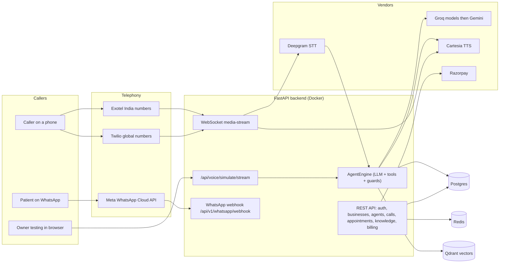
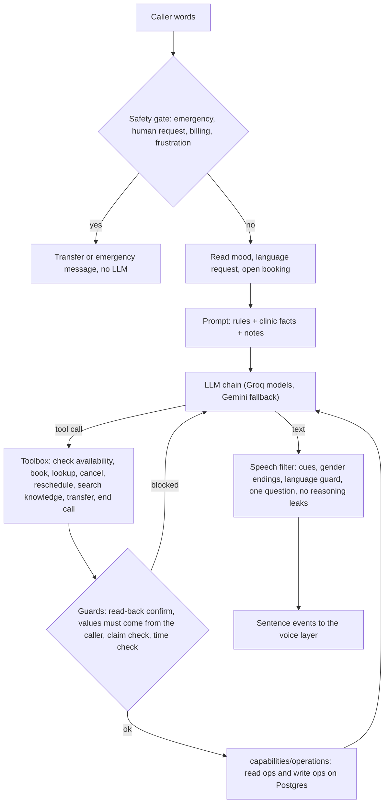
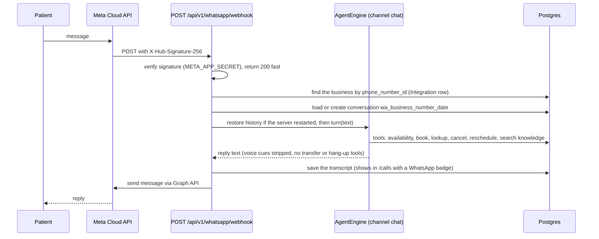
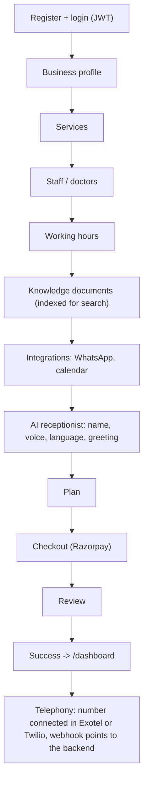
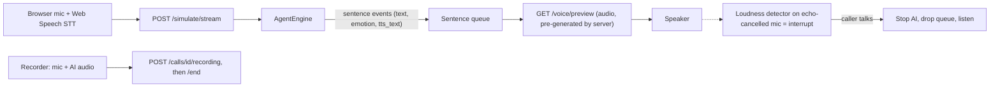

# AMSh AI Receptionist: Architecture, Pipelines, Status

Last verified against the code: 2026-09-28 (branch `v0.6`). Every status below says whether it is **tested by unit tests**,
**tried live**, or **only written**. Where a claim is a guess, it says so.

Detailed change log: [`17_AMSh_Claude_Change_Tracker.md`](17_AMSh_Claude_Change_Tracker.md). Older specs are listed at the
bottom (some are stale, see "Doc index").

## Progress at a glance (estimate, 2026-10-03, branch `complete`)

| Part | Done | Main pending |
|---|---|---|
| User frontend | ~90% | billing invoices are still static, plan-usage card, Marketing-site pages other than the landing page, Conversations polish; zero TypeScript errors, builds in production mode |
| Admin frontend | ~92% | a cross-tenant Customers list (the sidebar link goes to the dashboard); every other page runs on a real API (audit, security, staff, tickets, announcements, SEO, templates, verticals are new) |
| AI / voice | ~60% | **real phone-call test**, measured response time and cost per minute, outbound, live take-over; Hindi/Hinglish layer tested offline only |
| Server | ~85% | the in-app channel has no sender, Meta template submission, delivery webhooks, per-role permissions beyond staff management, overage billing; migrations 0006 to 0008 not yet run on Postgres |
| **Overall** | **~72%** | still little verified in a real browser or on a real call: see `26_AMSh_Owner_Actions.md` |

**What changed on branch `complete` (2026-10-03):** security hardening (webhook verification, authenticated and rate-limited voice endpoints, production
guard), message templates with real sending for booking confirmations, reminders, missed-call follow-up and staff alerts, admin SEO, audit, security,
staff, tickets, announcements and verticals on real APIs, real dashboard numbers (no invented figures), clinic Help and Support, quotas, suspended
clinics blocked, CI. Details: tracker entries 64 to 72 in `17_...`. What only the owner can do: `26_AMSh_Owner_Actions.md`.

Method and lists: [`../.brain/progress.md`](../.brain/progress.md).

---|---|---|
| User frontend | ~80% | onboarding plans / review / Twilio, conversations and analytics polish, dashboard still shows invented numbers when data is thin; billing invoices are fake |
| Admin frontend | ~44% | 14 mock pages (11 of 25 are real, incl. analytics, health, integrations, receptionists, appointments, conversations) |
| AI / voice | ~55% | real phone-call test (also confirms the latency work), outbound, live take-over; WhatsApp works on the Meta test number; Hindi/Hinglish layer tested offline only |
| Server | ~72% | **auth on the new billing endpoints**, payment records, admin APIs, quotas, Twilio / Exotel signatures, CI |
| **Overall** | **~56%** | little of it has been verified in a real browser or on a real call |

Method and lists: [`../.brain/progress.md`](../.brain/progress.md). What changed since 2026-09-28: tracker entries for 2026-09-30, 2026-10-01 (branch `v1.1`) and 2026-10-02/03 in `17_...`; new docs `19`, `20`, `21` (index in section 11).

---

## 1. What the product is

A multi-tenant SaaS: a clinic (healthcare only for the MVP) signs up, configures its business and an AI receptionist, and the
AI answers its phone calls (later also WhatsApp) 24/7: books, cancels and reschedules appointments, answers questions from the
clinic's own facts and documents, and hands over to a human when needed.

| Part | Where | Tech |
|---|---|---|
| Tenant dashboard + onboarding wizard | `frontend/user` | Next.js |
| Super-admin portal | `frontend/admin` | Next.js |
| API + auth + billing + data | `backend/server` | FastAPI, Postgres, Redis (Docker) |
| Voice/AI engine | `backend/ai` | Python: Deepgram STT, LLM agent, Cartesia TTS |
| Figma plugin | `my-figma-plugin` | separate, ignore |

`docker-compose.yml` runs api, postgres, redis and an ngrok tunnel (public URL for the phone providers' webhooks).

---

## 2. System architecture



---

## 3. Phone call pipeline (Exotel / Twilio)

```mermaid
sequenceDiagram
  participant C as Caller
  participant P as Exotel or Twilio
  participant B as Backend
  participant S as Deepgram STT
  participant A as AgentEngine
  participant L as LLM chain
  participant T as Cartesia TTS
  C->>P: dials the clinic number
  P->>B: webhook (Exotel /api/voice/exotel/incoming, Twilio /api/voice/incoming)
  B->>B: resolve the tenant business
  B-->>P: stream URL (wss /media-stream/business_id)
  P->>B: opens WebSocket, sends audio frames
  B->>T: greeting (from the Agent settings)
  T-->>P: greeting audio, streamed
  loop every turn
    P->>B: caller audio
    B->>S: audio frames (Deepgram nova-3, multi language en+hi)
    S-->>B: final transcript
    B->>A: run_turn(transcript)
    A->>L: messages + tool schemas
    L-->>A: sentence stream / tool calls
    A-->>B: sentence events (text, emotion, laugh)
    B->>T: synthesise sentence by sentence
    T-->>P: audio frames
    P-->>C: AI voice
  end
  Note over B,P: barge-in cancels playback; watchdog handles silence and max duration
  B->>B: call_recorder saves call, transcript, outcome
```

Key points, all from the code:

- **Tenant resolution:** Exotel (`/api/voice/exotel/incoming`) uses the `business_id` query param, else the dialed number,
  else the *newest active business*. Twilio (`/api/voice/incoming`) falls back to the newest business (any status). These
  fallbacks are a cross-tenant risk once there is more than one customer (see Improvements).
- **Engine switch:** `CONVERSATION_ENGINE` in `.env` (now `llm_agent`) with a per-tenant override in `Agent.config["engine"]`:
  `state_machine` (old templates), `shadow` (agent runs silently beside the old engine and logs both), `llm_agent`.
- **STT:** Deepgram live WebSocket; `nova-3` with `multi` for English/Hindi, falls back to the previous model if refused.
- **TTS:** Cartesia, per sentence, with speed and emotion; language auto-detected per sentence.
- **Recording:** provider recording URL is stored by the webhook (untested live). Browser test calls are recorded by the
  browser (section 6).

### 3a. One agent turn (what happens inside `AgentEngine`)



### 3b. LLM provider chain

Groq models (from the live catalogue, chosen in AI Studio) then Gemini, with per-provider cooldowns after 429/5xx. The Groq
free tier (8k tokens/min, 200k/day per model) is the main reliability risk.

---

## 4. WhatsApp chat pipeline

### Built (2026-09-28): same brain, text channel



Code: `backend/server/services/whatsapp_agent.py`, webhook in `routes/integrations.py`. Connect (embedded signup) and the test
message existed before. Covered by 6 unit tests with a fake sender and fake model.

**Live on the Meta test number since 2026-10-02** (patient messaged, the agent replied and booked; see `20_...` section 4 for the
go-live checklist: WABA subscription, real App Secret, `docker compose up -d --force-recreate api` after `.env` changes, template for the
first message). Added the same day: returning-patient memory and a privacy rule, no SMS for WhatsApp bookings, every booking carries its
channel (phone / WhatsApp / website chat / email / social / front desk / dashboard), WhatsApp-specific wording. Still **not verified**:
Meta's retry behaviour on a long outage, a second-day conversation, and the 24 h rule (free-form replies only work within 24 h of the patient's message; reminders later need
approved templates). Not built: images / voice notes (the patient gets a polite "please type"), template messages,
human takeover from the dashboard, a per-business on/off switch for the WhatsApp agent.

---

## 5. Onboarding and tenant setup

Wizard pages in `frontend/user/app/onboarding`: business, services, staff, hours, knowledge, integrations, ai-receptionist,
plans, checkout, review, success. Detailed API mapping: [`flowcharts/onboarding_flow.md`](flowcharts/onboarding_flow.md).



**Telephony onboarding** is the owner's own process (per the owner: already defined and handled outside this code). The
code side is the two webhooks: `/api/voice/exotel/incoming` (Exotel Voicebot applet) and `/api/voice/incoming` (Twilio).
Call forwarding / transfer design: [`11_AMSh_Telephony_Call_Transfer_and_Forwarding.md`](11_AMSh_Telephony_Call_Transfer_and_Forwarding.md).

---

## 6. Dashboard flows

### 6a. AI Studio (`/ai`) and playgrounds

Two test surfaces: the **AI Studio Workbench** and the **Test Playground modal**. Both: browser speech recognition -> `POST
/api/voice/simulate/stream` (NDJSON, one event per sentence) -> Cartesia audio per sentence via `/api/voice/preview`.



Note: playground speech recognition is Chrome's, **not Deepgram**; Deepgram is used only on real phone calls.

### 6b. Calls page (`/calls`)

List and detail from `GET /api/businesses/{id}/calls`; playground calls are labelled **Test call** (`is_test`) and can be
hidden; recordings play from `/api/recordings/{call_id}/{token}` (files in `backend/data/recordings`); calls left `live` are
closed when the list loads.

### 6c. Escalation, appointments, staff, knowledge, billing

Standard CRUD routes under `backend/server/api/routes`; the AI reads and writes appointments through
`backend/ai/capabilities/operations` (read ops separate from write ops).

---

## 7. Capabilities layers (`backend/ai/capabilities`)

| Layer | Meaning | Files | Used by the agent? |
|---|---|---|---|
| Rules | deterministic, no LLM | `rules/safety_emergency.py`, `business_hours.py`, `compliance_pii.py` | yes: emergency gate, open/closed line in prompt, log redaction |
| Skills | workflows and behaviour | `skills/*` (legacy engine) plus `engine/agent/progress.py`, `emotion.py` | agent skills live in `engine/agent/` (not moved yet) |
| Operations | read vs write on data | `operations/*/read_operations.py`, `write_operations.py` | yes: toolbox reads and writes only through them |

---

## 8. Status by module

Legend: **Live** = tried against real services this session, **Tested** = unit tests only, **Written** = code exists, not
run, **Stub** = placeholder, **Missing** = does not exist.

| Module | Status | Notes |
|---|---|---|
| Auth, businesses, agents, services, staff, appointments CRUD | Written / used by dashboard | Basic flows were working earlier (see doc 06); not re-tested this session |
| Onboarding wizard | Written | Wired to the API per `flowcharts/onboarding_flow.md`; not re-run end to end |
| LLM agent (tools, guards, streaming) | Tested (168 tests) + Live in playground | 59 eval scenarios exist; live eval was partly run and limited by Groq quota |
| LLM provider chain + live model picker | Live | Groq daily cap hit often; Gemini fallback works |
| Voice: Cartesia TTS, Indian voices, speed/emotion | Live (previews) | Credits are running low (owner report) |
| Emotion engine (laugh, sympathy) | Tested | How it sounds was not judged by me |
| Voice interruption (loudness detector) | Written | Thresholds are guesses; needs listening tests |
| STT on phone (Deepgram nova-3 multi) | Tested (fallback logic) | A real phone call was not made this session |
| STT in playground | Web Speech (Chrome) | Deepgram not used there |
| Phone webhooks (Exotel, Twilio) and media stream | Written | Pre-existing; not re-verified live |
| Call recording (browser calls) + `/calls` playback | Tested (backend) | Browser flow not tried live |
| Call recording (real phone calls) | Written | Provider URL stored by webhook; unverified |
| Session resume after server reload | Tested | |
| Capabilities: rules, operations | Tested | Skills move into `capabilities/` not done |
| Knowledge / RAG | Partial | Qdrant showed **not ready** in the startup warmup; `search_knowledge` returns nothing if the search fails |
| WhatsApp connect + test message | Written | Not verified live |
| WhatsApp AI chat | Tested (6 tests, fake sender + fake model) | Built 2026-09-28; **not tried with a real number**; needs `META_APP_SECRET` |
| SMS confirmations | Written | Guarded by `AMSH_DISABLE_SMS`; it will send real SMS when enabled |
| Billing / Razorpay / plans | Written | Not re-tested |
| Workers, calendar, CRM, e-commerce, payments integrations, analytics | Stub | Folders contain only `__init__.py` |
| **Admin portal (`frontend/admin`)** | **4 areas real, 20 pages still mock (with a banner)** | Real: admin login and guard, **Dashboard** (live counts, calls, appointments, estimated revenue, AI resolution rate, busiest businesses, platform health, recent activity), Businesses list (search, filters, suspend / reactivate / change plan), **Business detail** (overview, users, AI receptionist, appointments, calls, services, knowledge base, integrations, activity), **Billing** (plan catalog create / edit / archive, plan distribution, business subscriptions). Backend tested; `tsc`, eslint and `next build` pass; read against live data; **not clicked through in a browser**. Every other admin page is a design mock and shows an amber "Sample data" banner: business-users, admin-users, appointments, calls, conversations, customers, services, receptionists, usage, analytics, health, integrations, security, audit, tickets, announcements, verticals. No payments or invoices are recorded anywhere, so revenue is an estimate from plan prices. Sidebar links `/notifications` and `/settings` point to pages that do not exist |
| Post-call record: real summary, intent, sentiment, action items (model + keyword fallback; booking and emergency decided by the database and rules) | Tested + model output checked live | Runs in the background when any call ends; shown in `/calls`; Postgres at migration 0003 |
| Appointment reminders (SMS; WhatsApp template optional) | Tested with fakes | **Off by default** (`REMINDERS_ENABLED` and the clinic's `toggles.reminders`); no dashboard switch yet; not tried with a real SMS provider |
| Missed-call text-back and staff alerts (SMS / email) | Tested with fakes | Opt-in per clinic through `Agent.config` (`toggles.missed_call_followup`, `alerts`); no dashboard UI yet |
| Calendar feed (`.ics` subscription for Google / Outlook / Apple) | Tested | Read-only subscription, not two-way sync; URL from `GET /api/businesses/{id}/calendar-feed`; no dashboard button yet |
| Auth: forgot / reset / change password, email verification, audit log, login lockout, admin login | Tested (backend, 24 tests) | Frontend: forgot, reset, change-password wired; verify-email page not wired; emails only proven with a fake sender + log fallback |
| Database migrations (Alembic) | Tested + Live | Real Postgres stamped at 0001 and upgraded to 0002 |
| User app pages: team, billing, integrations, conversations, notifications, analytics, most settings tabs | Static UI | No backend for several of them. See section 9 |
| Backend tests folder | Empty | The tests live in `backend/ai/evals/test_agent_core.py` |

---

## 9. What is pending (full list, 2026-09-28; **partly out of date: see the progress box above, `23_...` section 5 and `26_...`**)

Plan and order for the big items: [`18_AMSh_Completion_Plan_User_and_Admin.md`](18_AMSh_Completion_Plan_User_and_Admin.md).
Legend: **[A]** admin portal, **[U]** user app, **[V]** voice/AI, **[W]** WhatsApp, **[P]** platform/infra, **[O]** owner action.

### Who is working on what (2026-09-28): READ THIS BEFORE STARTING ANY PENDING ITEM
- **User side (`frontend/user`, and the user-facing analytics backend such as `backend/server/api/routes/dashboard_stats.py`) is being
  worked on by Antigravity right now.** Its uncommitted work already includes: many dashboard headers, analytics KPIs and charts
  (`AIPerformanceCard`, `CallVolumeChart`, `CallVolumeTrendChart`, `CallOutcomesChart`, `AppointmentSourcesChart`,
  `BusiestCallingHoursHeatmap`, `TopCallReasonsList`, `RecentAIConversations`), `ServiceModal`, `analytics.controller.ts`, and edits to the
  dashboard, analytics, appointments, billing, conversations, integrations, notifications, services, settings and team pages.
  **Do not start the user-app items in section 9 (U) from this list without checking `git status` and asking who has them.**
  Some of those items (analytics, services, conversations, notifications, billing, team, settings) may already be in progress or done there.
- **Admin portal (`frontend/admin`, `backend/server/api/routes/admin.py`) is being worked on by Claude.**
- **Overlap to reconcile:** on the user side Claude also changed these files today (uncommitted, may conflict with Antigravity's edits):
  `(auth)/forgot-password`, `(auth)/reset-password` (new), `(auth)/verify-email`, `settings/SecuritySettings.tsx`,
  `settings/NotificationSettings.tsx` (rewritten into a real "Automations and alerts" tab), `middleware.ts` (public auth paths),
  `controllers/auth.controller.ts`, `controllers/dashboard.controller.ts` (calendar feed, config types, call fields),
  `utils/api_endpoints.ts`, `CallDetailPanel.tsx`, `CallLogsTable.tsx`, `calls/page.tsx`. If a merge conflict appears, keep both sets of changes.
- Claude's backend-only work (auth, migrations, post-call analysis, reminders, alerts, calendar feed, WhatsApp chat, admin) does not overlap with the user side.

### Admin portal: batch 1 done, the rest pending (23 of 25 pages are still mock)
Built so far: admin login and session guard, `GET /api/admin/tenants` (+ detail), `PATCH /api/admin/tenants/{id}` (suspend, reactivate,
plan; audited; a suspended clinic's phone calls are refused), the real Businesses page, and the `create_platform_admin` script.
Still to do: blocking a suspended clinic's dashboard login, admin password reset, and everything below:
1. **[A]** Business detail page wired to `GET /api/admin/tenants/{id}`; remove or build the sidebar's `/notifications` and `/settings` links; a shared loading / empty / error component for the other pages; plan limits (tenants have no stored usage limits, so there is no usage percentage yet).
2. **[A]** Plan catalog is built (create / edit / archive at `/billing`, public `GET /api/plans`). Still to do: **enforce** a plan's quotas per business (minutes, messages, seats, ... are stored but nothing counts or blocks yet), real billing analytics (the billing page's revenue, subscriptions and invoices are sample data), and wiring the tenant app's pricing screens to `GET /api/plans` (user side, Antigravity): its checkout still shows hard-coded prices while the server now charges the plan's price. Razorpay orders now take price and currency from the plan and `verify` checks Razorpay's own order (done, tested with fakes, not tried with real keys); the seeded plans are USD, so set INR on a plan if the Razorpay account cannot charge USD. `GET /api/billing/businesses/{id}` is still unauthenticated.
3. **[A]** Users: business-users and admin-users (create, deactivate, roles, reset link).
4. **[A]** Cross-tenant reads: appointments, calls (+ recordings), conversations, customers, services, receptionists (agents).
5. **[A]** Billing, usage and platform analytics (revenue, subscriptions, invoices, failed payments).
6. **[A]** Health page (API, DB, Redis, Qdrant, Deepgram, Cartesia, Groq/Gemini status and credits).
7. **[A]** Security and audit pages (the `audit_logs` table exists and is being written; no read endpoint or page yet).
8. **[A]** Tickets and announcements (new models, endpoints, email on reply), integrations overview, verticals.
9. **[A]** Remove the mock data from all 25 pages; some screens may need small redesigns once real data shapes are known.

### User app
1. **[U]** Team page: list, invite by email, change role, deactivate, resend/revoke (backend has only create + list).
2. **[U]** Settings: profile, notification preferences, AI defaults, sessions (Business tab is wired; the rest is static).
3. **[U]** Conversations inbox (calls + WhatsApp), with human takeover for WhatsApp. No backend yet.
4. **[U]** Analytics (KPIs and charts are hard-coded; needs real queries). Someone else has uncommitted dashboard-home work in
   progress (`dashboard_stats.py`, new chart components): check it before starting analytics.
5. **[U]** Notifications (model, list, mark read, events from bookings / missed calls / escalations).
6. **[U]** Billing page (plan, usage vs limits, invoices, cancel / change plan, payment method); Razorpay create/verify exists.
7. **[U]** Integrations page grid and Developer settings (static); Twilio connect step; Google/Outlook calendar OAuth (stubs).
8. **[U]** Onboarding: plans, review (submit) and Twilio pages are UI-only.
9. **[U]** Verify-email page is not wired to the new endpoint; no "please verify" banner; accept-invite page makes no call.
10. **[U]** Patients: edit, delete, appointment and call history. Services header actions. Landing page links and pricing text.
11. **[U]** Two-factor sign-in (button now says "Coming soon"), refresh token, logout everywhere, session list.
12. **[U]** Register still accepts any password length (reset/change require 8).

### Voice and AI
1. **[V]** Deepgram in the playgrounds: backend relay done and verified live; the browser adapter replacing Chrome speech
   recognition is not written.
2. **[V]** One real phone call (Exotel or Twilio) to verify nova-3 multi, streaming, interrupt and the recording URL.
3. **[V]** Listening tests: laugh / emotion quality, interruption thresholds (`barge_in.ts`), Indian voices, `/calls` playback.
4. **[V]** Move `availability.py`, `datetime_utils.py`, `progress.py`, `emotion.py` into `capabilities/` with shims.
5. **[V]** Live eval re-run when the Groq quota allows; then retire the old template engine.
6. **[V]** "Open now" line refresh on long calls; Qdrant not ready at startup (knowledge search returns nothing).
7. **[V]** Deeper human behaviour (backchannels, hold sounds while tools run, per-personality emotion strength).
8. **[U]** Owner switches with no UI yet: reminders (`toggles.reminders`, `reminders.lead_hours`, `reminders.whatsapp_template`), missed-call text-back (`toggles.missed_call_followup`), staff alerts (`alerts.phone` / `email` / `events`), calendar feed button. They are set through the agent config API today.
9. **[U]** Live call take-over: the admin portal has a mock screen for it and the tenant dashboard has none; the backend has only transfer-to-human. Real take-over needs a signalling path (join or redirect the live Twilio / Exotel call) and belongs in the tenant dashboard first.
10. **[V]** Also from the market comparison, still to build: returning-patient recognition and intake, website widget, analytics with revenue estimate, outbound campaigns, compliance basics (recording disclosure, retention), agent versions and simulations, more Indian languages.

### WhatsApp
1. **[W]** Done on the Meta test number (2026-10-02). To do: a real clinic number (not the test number), rotate the App Secret that was pasted in a chat, check Meta's delivery statuses.
2. **[W]** Template messages (needed after 24 h and for reminders), media / voice notes, human takeover, per-business switch.
3. **[W]** Reminders exist (SMS; WhatsApp needs an approved template). To do: real-provider test, reply handling (a reply on WhatsApp starts a fresh conversation that does not know about the reminder), dashboard switch.

### Platform and infrastructure
1. **[P]** Email delivery: set `RESEND_API_KEY` (and `EMAIL_FROM`, `FRONTEND_URL`); until then reset / verify links only appear in the API log.
2. **[P]** Email verification policy: currently informational (no feature is blocked for unverified users).
3. **[P]** Provider signature checks for Twilio and Exotel; rate limiting on public endpoints (login lockout exists).
4. **[P]** Production: `ALLOW_DEV_FALLBACKS=false`, uvicorn without `--reload`, sessions in Redis, recordings in object storage.
5. **[P]** Tests: `backend/tests` is empty (all tests are in `backend/ai/evals`); add tenant-isolation tests per new endpoint; CI.
6. **[P]** Per-call metrics and cost tracking for the investor story; PII redaction in every log line.

### Owner actions
1. **[O]** Groq paid tier (the free caps make live use unreliable). 2. Cartesia credits are nearly used up.
3. Put `META_APP_SECRET` and `RESEND_API_KEY` in `.env`. 4. Rotate keys that were once printed in a terminal.
5. Delete the duplicate agents in the demo business. 6. Run `python -m backend.scripts.create_platform_admin <email>`.
7. Keep `AMSH_DISABLE_SMS` on until real SMS is wanted. 8. Try everything in a browser and on a real call: most of the
   voice, recording and auth work has unit tests but was not clicked through.

### Housekeeping
1. Uncommitted work (about 36 files on `v0.7`) needs a commit plan; keep the other person's dashboard files in a separate commit.
2. `scratch/test_cartesia*.py` and `scratch/test_models.py` were committed by accident.
3. Status docs overlap. Source of truth: this README (status + pending), `17` (change log), `18` (plan). The others
   (`04`, `.brain/progress.md` and the archive) are history or scope notes. The old status reviews, module tracker, backend
   roadmap and daily roadmap were deleted on 2026-09-28. Percentages per part live in `.brain/progress.md`.

---

## 10. How we can make it better (my recommendations, ordered by value)

1. **WhatsApp go-live and hardening.** The agent exists; verify it with a real number, add template messages for reminders,
   media handling and a human-takeover switch in the dashboard.
2. **Real-call quality loop.** Log per call: time to first audio, STT confidence, guard blocks, transfers, cost. Without
   numbers, "feels human and fast" cannot be proven to an investor. Add a small dashboard from that.
3. **Tenant safety.** Set `ALLOW_DEV_FALLBACKS=false` in production (done in code: it turns off the "newest business" fallback
   in the Exotel and Twilio webhooks and the old hard-coded WhatsApp verify tokens; default is still true so your current
   tests keep working). Still to do: Twilio and Exotel signature checks, rate limiting on public endpoints. Meta's signature
   is now verified.
4. **Reliability.** Keep sessions in Redis (multi-worker and restarts); move recordings from local disk to object storage;
   run uvicorn without `--reload` in production; a paid LLM tier and a second provider in the chain.
5. **Reminders and no-show reduction.** The `workers/jobs` folder is empty: add appointment reminders over WhatsApp/SMS with
   confirm / reschedule replies (reuses the same agent).
6. **Calendar sync.** Google Calendar so bookings show up where the clinic already works; stubs exist.
7. **Human handoff.** A live "needs a human" queue in the dashboard with the transcript so far.
8. **Voice.** Per-clinic voice cloning, tuned emotion strength per personality, a "hold on" sound while tools run, and
   backchannels ("hmm", "ji") during long caller sentences.
9. **Knowledge.** Bring Qdrant up in Docker and show indexing status in the Knowledge tab; cite which document answered.
10. **Cost control.** Cache TTS for repeated lines (greeting, confirmations), trim prompt tokens, measure cost per call.
11. **Testing.** Move the eval tests into `backend/tests`, run them in CI, and add a nightly small live eval with a fixed budget.
12. **Security hygiene.** Secrets only in `.env`; a pre-commit secret scan; PII redaction in every log line, not just the
    shadow log.

---

## 11. Doc index

| Doc | About | State |
|---|---|---|
| `README.md` (this file) | overview, pipelines, status | current |
| `17_AMSh_Claude_Change_Tracker.md` | every change with evidence and limits | current (to 2026-10-03; the 2026-10-01 latency entries came in with the merge of `v1.1` into `v1.5`) |
| `19_AMSh_Summit_Pitch.md` | summit talking points, competitors, ask checklist | current |
| `20_AMSh_Returning_Patient_Memory_and_Privacy.md` | patient memory, privacy rules, booking channels, WhatsApp go-live checklist | current |
| `23_AMSh_System_Audit_2026-10-03.md` | full system audit: what works, P0 / P1 problems, unused code, order of work | current |
| `24_AMSh_Message_Templates_and_Channels_Plan.md` | editable templates for email, SMS, WhatsApp and in-app messages, channel order, quiet hours, logs, compliance; section 11 is the built API and sending | partly built |
| `25_AMSh_Competitive_Analysis_and_Roadmap.md` | Vapi, Retell and Bland compared with AMSh, gaps and the order to close them, sources | current |
| `26_AMSh_Owner_Actions.md` | everything only the owner can do: secrets, accounts, tests, decisions | current |
| `22_AMSh_Language_Packs_and_Runtime_Context.md` | five independent dimensions (vertical, language, accent, region, timezone), language packs, RTL readiness, languages endpoint | current |
| `21_AMSh_Language_Layer_and_Slot_Rules.md` | BusinessContext (vertical + region + language config), Hindi/Hinglish layer, slot rules, booking guard | current |
| `18_AMSh_Completion_Plan_User_and_Admin.md` | phased plan for the user app, admin portal and server APIs (done / pending) | current |
| `../.brain/progress.md` | overall progress percentage per part | current |
| `features_list.md` | what the AI can do, with honest status tags, target features from docs 01-03, landing-page copy and claims to avoid | current |
| `16_...Tool_Calling_Architecture_Plan.md` | agent design | current |
| `15_...Conversational_NLU_and_Persona...` | persona/NLU spec | partly superseded by 16 |
| `14_...Telephony_Tunnels_and_AI_Capabilities_Spec.md` | tunnels + capabilities | see section 7 for the current mapping |
| `11_...Telephony_Call_Transfer_and_Forwarding.md` | forwarding design | design |
| `08_...Integrations_Setup_Guide.md` | provider setup | check keys/URLs before use |
| `flowcharts/*` | login, onboarding, integrations | valid; the agent's flow is in section 3a |
| `04_AMSh_MVP_Scope_and_Roadmap.md` | MVP ground rules and the not-MVP list | trimmed to those two sections |
| `01-03 .docx` | target features from the research (already / missing / roadmap) | still the feature target; mapped to real status in `features_list.md` |
| `05`, `07`, `09`, `10`, `12`, PRD, structure specs | planning and history | not re-checked this session |
| `../ai generated docs/*` | RAG and agent plans | RAG docs not re-checked |
