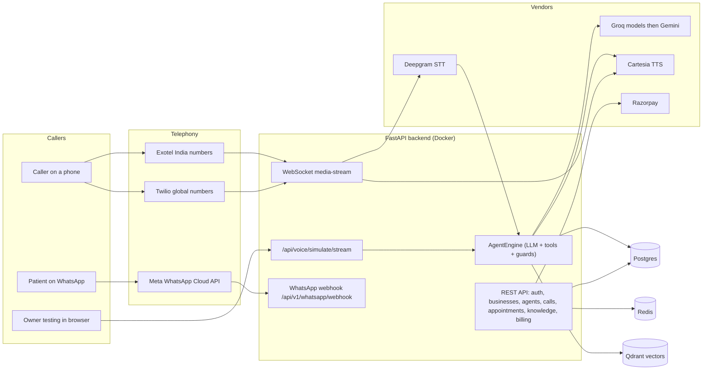
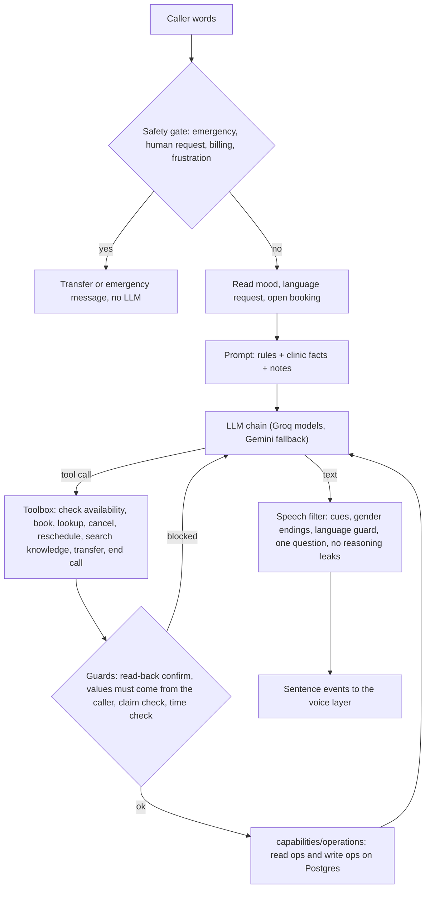
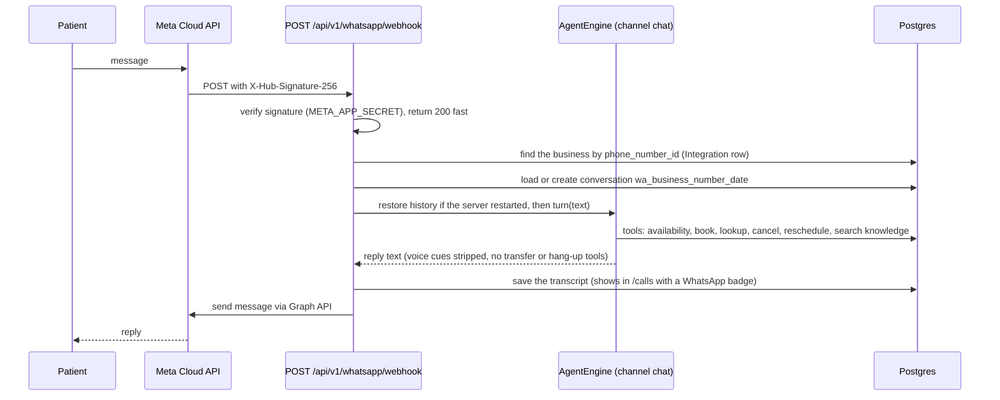
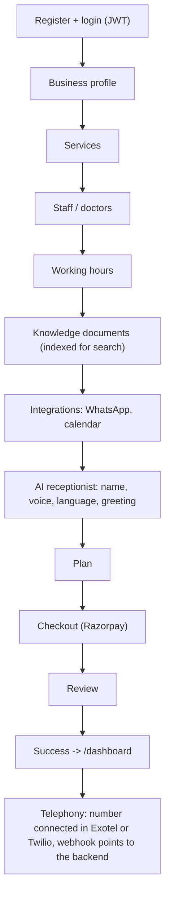
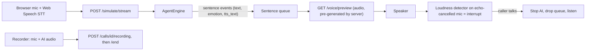

# AMSh AI Receptionist: Architecture, Pipelines, Status

Last verified against the code: 2026-09-28 (branch `v0.6`). Every status below says whether it is **tested by unit tests**,
**tried live**, or **only written**. Where a claim is a guess, it says so.

Detailed change log: [`17_AMSh_Claude_Change_Tracker.md`](17_AMSh_Claude_Change_Tracker.md). Older specs are listed at the
bottom (some are stale, see "Doc index").

---

## 1. What the product is

A multi-tenant SaaS: a clinic (healthcare only for the MVP) signs up, configures its business and an AI receptionist, and the
AI answers its phone calls (later also WhatsApp) 24/7: books, cancels and reschedules appointments, answers questions from the
clinic's own facts and documents, and hands over to a human when needed.

| Part | Where | Tech |
|---|---|---|
| Tenant dashboard + onboarding wizard | `frontend/user` | Next.js |
| Super-admin portal | `frontend/admin` | Next.js |
| API + auth + billing + data | `backend/server` | FastAPI, Postgres, Redis (Docker) |
| Voice/AI engine | `backend/ai` | Python: Deepgram STT, LLM agent, Cartesia TTS |
| Figma plugin | `my-figma-plugin` | separate, ignore |

`docker-compose.yml` runs api, postgres, redis and an ngrok tunnel (public URL for the phone providers' webhooks).

---

## 2. System architecture



---

## 3. Phone call pipeline (Exotel / Twilio)

```mermaid
sequenceDiagram
  participant C as Caller
  participant P as Exotel or Twilio
  participant B as Backend
  participant S as Deepgram STT
  participant A as AgentEngine
  participant L as LLM chain
  participant T as Cartesia TTS
  C->>P: dials the clinic number
  P->>B: webhook (Exotel /api/voice/exotel/incoming, Twilio /api/voice/incoming)
  B->>B: resolve the tenant business
  B-->>P: stream URL (wss /media-stream/business_id)
  P->>B: opens WebSocket, sends audio frames
  B->>T: greeting (from the Agent settings)
  T-->>P: greeting audio, streamed
  loop every turn
    P->>B: caller audio
    B->>S: audio frames (Deepgram nova-3, multi language en+hi)
    S-->>B: final transcript
    B->>A: run_turn(transcript)
    A->>L: messages + tool schemas
    L-->>A: sentence stream / tool calls
    A-->>B: sentence events (text, emotion, laugh)
    B->>T: synthesise sentence by sentence
    T-->>P: audio frames
    P-->>C: AI voice
  end
  Note over B,P: barge-in cancels playback; watchdog handles silence and max duration
  B->>B: call_recorder saves call, transcript, outcome
```

Key points, all from the code:

- **Tenant resolution:** Exotel (`/api/voice/exotel/incoming`) uses the `business_id` query param, else the dialed number,
  else the *newest active business*. Twilio (`/api/voice/incoming`) falls back to the newest business (any status). These
  fallbacks are a cross-tenant risk once there is more than one customer (see Improvements).
- **Engine switch:** `CONVERSATION_ENGINE` in `.env` (now `llm_agent`) with a per-tenant override in `Agent.config["engine"]`:
  `state_machine` (old templates), `shadow` (agent runs silently beside the old engine and logs both), `llm_agent`.
- **STT:** Deepgram live WebSocket; `nova-3` with `multi` for English/Hindi, falls back to the previous model if refused.
- **TTS:** Cartesia, per sentence, with speed and emotion; language auto-detected per sentence.
- **Recording:** provider recording URL is stored by the webhook (untested live). Browser test calls are recorded by the
  browser (section 6).

### 3a. One agent turn (what happens inside `AgentEngine`)



### 3b. LLM provider chain

Groq models (from the live catalogue, chosen in AI Studio) then Gemini, with per-provider cooldowns after 429/5xx. The Groq
free tier (8k tokens/min, 200k/day per model) is the main reliability risk.

---

## 4. WhatsApp chat pipeline

### Built (2026-09-28): same brain, text channel



Code: `backend/server/services/whatsapp_agent.py`, webhook in `routes/integrations.py`. Connect (embedded signup) and the test
message existed before. Covered by 6 unit tests with a fake sender and fake model.

**Not verified live** (needs a connected WhatsApp number and `META_APP_SECRET` in `.env`): a real message end to end, Meta's
retry behaviour, and the 24 h rule (free-form replies only work within 24 h of the patient's message; reminders later need
approved templates). Not built: images / voice notes (the patient gets a polite "please type"), template messages,
human takeover from the dashboard, a per-business on/off switch for the WhatsApp agent.

---

## 5. Onboarding and tenant setup

Wizard pages in `frontend/user/app/onboarding`: business, services, staff, hours, knowledge, integrations, ai-receptionist,
plans, checkout, review, success. Detailed API mapping: [`flowcharts/onboarding_flow.md`](flowcharts/onboarding_flow.md).



**Telephony onboarding** is the owner's own process (per the owner: already defined and handled outside this code). The
code side is the two webhooks: `/api/voice/exotel/incoming` (Exotel Voicebot applet) and `/api/voice/incoming` (Twilio).
Call forwarding / transfer design: [`11_AMSh_Telephony_Call_Transfer_and_Forwarding.md`](11_AMSh_Telephony_Call_Transfer_and_Forwarding.md).

---

## 6. Dashboard flows

### 6a. AI Studio (`/ai`) and playgrounds

Two test surfaces: the **AI Studio Workbench** and the **Test Playground modal**. Both: browser speech recognition -> `POST
/api/voice/simulate/stream` (NDJSON, one event per sentence) -> Cartesia audio per sentence via `/api/voice/preview`.



Note: playground speech recognition is Chrome's, **not Deepgram**; Deepgram is used only on real phone calls.

### 6b. Calls page (`/calls`)

List and detail from `GET /api/businesses/{id}/calls`; playground calls are labelled **Test call** (`is_test`) and can be
hidden; recordings play from `/api/recordings/{call_id}/{token}` (files in `backend/data/recordings`); calls left `live` are
closed when the list loads.

### 6c. Escalation, appointments, staff, knowledge, billing

Standard CRUD routes under `backend/server/api/routes`; the AI reads and writes appointments through
`backend/ai/capabilities/operations` (read ops separate from write ops).

---

## 7. Capabilities layers (`backend/ai/capabilities`)

| Layer | Meaning | Files | Used by the agent? |
|---|---|---|---|
| Rules | deterministic, no LLM | `rules/safety_emergency.py`, `business_hours.py`, `compliance_pii.py` | yes: emergency gate, open/closed line in prompt, log redaction |
| Skills | workflows and behaviour | `skills/*` (legacy engine) plus `engine/agent/progress.py`, `emotion.py` | agent skills live in `engine/agent/` (not moved yet) |
| Operations | read vs write on data | `operations/*/read_operations.py`, `write_operations.py` | yes: toolbox reads and writes only through them |

---

## 8. Status by module

Legend: **Live** = tried against real services this session, **Tested** = unit tests only, **Written** = code exists, not
run, **Stub** = placeholder, **Missing** = does not exist.

| Module | Status | Notes |
|---|---|---|
| Auth, businesses, agents, services, staff, appointments CRUD | Written / used by dashboard | Basic flows were working earlier (see doc 06); not re-tested this session |
| Onboarding wizard | Written | Wired to the API per `flowcharts/onboarding_flow.md`; not re-run end to end |
| LLM agent (tools, guards, streaming) | Tested (168 tests) + Live in playground | 59 eval scenarios exist; live eval was partly run and limited by Groq quota |
| LLM provider chain + live model picker | Live | Groq daily cap hit often; Gemini fallback works |
| Voice: Cartesia TTS, Indian voices, speed/emotion | Live (previews) | Credits are running low (owner report) |
| Emotion engine (laugh, sympathy) | Tested | How it sounds was not judged by me |
| Voice interruption (loudness detector) | Written | Thresholds are guesses; needs listening tests |
| STT on phone (Deepgram nova-3 multi) | Tested (fallback logic) | A real phone call was not made this session |
| STT in playground | Web Speech (Chrome) | Deepgram not used there |
| Phone webhooks (Exotel, Twilio) and media stream | Written | Pre-existing; not re-verified live |
| Call recording (browser calls) + `/calls` playback | Tested (backend) | Browser flow not tried live |
| Call recording (real phone calls) | Written | Provider URL stored by webhook; unverified |
| Session resume after server reload | Tested | |
| Capabilities: rules, operations | Tested | Skills move into `capabilities/` not done |
| Knowledge / RAG | Partial | Qdrant showed **not ready** in the startup warmup; `search_knowledge` returns nothing if the search fails |
| WhatsApp connect + test message | Written | Not verified live |
| WhatsApp AI chat | Tested (6 tests, fake sender + fake model) | Built 2026-09-28; **not tried with a real number**; needs `META_APP_SECRET` |
| SMS confirmations | Written | Guarded by `AMSH_DISABLE_SMS`; it will send real SMS when enabled |
| Billing / Razorpay / plans | Written | Not re-tested |
| Workers, calendar, CRM, e-commerce, payments integrations, analytics | Stub | Folders contain only `__init__.py` |
| Admin portal (`frontend/admin`) | Unknown | Not inspected this session |
| Backend tests folder | Empty | The tests live in `backend/ai/evals/test_agent_core.py` |

---

## 9. What is pending

**Owner actions**
1. Groq paid tier (Dev tier) or another provider; the free caps make live use unreliable.
2. Top up Cartesia credits (or decide how to spend them: previews are billed per character).
3. Rotate every key that was ever printed in a terminal (one alias printed keys earlier).
4. Delete the duplicate agents in the demo business (4 agents; the oldest wins).
5. Decide: enable `AMSH_DISABLE_SMS=0` only when ready to send real SMS.
6. Make one real phone call (Exotel or Twilio) to verify nova-3 multi, streaming, barge-in and the recording URL.
7. Listen-test: laugh/emotion quality, interruption thresholds, Indian voices, `/calls` playback.

**Engineering, next in line**
1. Try the WhatsApp agent with a real connected number; then media, templates, human takeover.
2. Deepgram-based STT for the playgrounds (backend WebSocket proxy).
3. Move `availability.py`, `datetime_utils.py`, `progress.py`, `emotion.py` into `capabilities/` with shims.
4. Live eval re-run once the quota allows; then retire the old template engine.
5. Tune the interruption detector after listening tests.
6. Make the "open now" line refresh during long calls.

---

## 10. How we can make it better (my recommendations, ordered by value)

1. **WhatsApp go-live and hardening.** The agent exists; verify it with a real number, add template messages for reminders,
   media handling and a human-takeover switch in the dashboard.
2. **Real-call quality loop.** Log per call: time to first audio, STT confidence, guard blocks, transfers, cost. Without
   numbers, "feels human and fast" cannot be proven to an investor. Add a small dashboard from that.
3. **Tenant safety.** Set `ALLOW_DEV_FALLBACKS=false` in production (done in code: it turns off the "newest business" fallback
   in the Exotel and Twilio webhooks and the old hard-coded WhatsApp verify tokens; default is still true so your current
   tests keep working). Still to do: Twilio and Exotel signature checks, rate limiting on public endpoints. Meta's signature
   is now verified.
4. **Reliability.** Keep sessions in Redis (multi-worker and restarts); move recordings from local disk to object storage;
   run uvicorn without `--reload` in production; a paid LLM tier and a second provider in the chain.
5. **Reminders and no-show reduction.** The `workers/jobs` folder is empty: add appointment reminders over WhatsApp/SMS with
   confirm / reschedule replies (reuses the same agent).
6. **Calendar sync.** Google Calendar so bookings show up where the clinic already works; stubs exist.
7. **Human handoff.** A live "needs a human" queue in the dashboard with the transcript so far.
8. **Voice.** Per-clinic voice cloning, tuned emotion strength per personality, a "hold on" sound while tools run, and
   backchannels ("hmm", "ji") during long caller sentences.
9. **Knowledge.** Bring Qdrant up in Docker and show indexing status in the Knowledge tab; cite which document answered.
10. **Cost control.** Cache TTS for repeated lines (greeting, confirmations), trim prompt tokens, measure cost per call.
11. **Testing.** Move the eval tests into `backend/tests`, run them in CI, and add a nightly small live eval with a fixed budget.
12. **Security hygiene.** Secrets only in `.env`; a pre-commit secret scan; PII redaction in every log line, not just the
    shadow log.

---

## 11. Doc index

| Doc | About | State |
|---|---|---|
| `README.md` (this file) | overview, pipelines, status | current |
| `17_AMSh_Claude_Change_Tracker.md` | every change with evidence and limits | current (entries 1-48) |
| `16_...Tool_Calling_Architecture_Plan.md` | agent design | current |
| `15_...Conversational_NLU_and_Persona...` | persona/NLU spec | partly superseded by 16 |
| `14_...Telephony_Tunnels_and_AI_Capabilities_Spec.md` | tunnels + capabilities | see section 7 for the current mapping |
| `13_...Module_Status_and_Live_Tracking.md` | module status | older; see section 8 above |
| `11_...Telephony_Call_Transfer_and_Forwarding.md` | forwarding design | design |
| `08_...Integrations_Setup_Guide.md` | provider setup | check keys/URLs before use |
| `06_...Project_Status_Review.md` | earlier status review | older; see section 8 above |
| `flowcharts/*` | login, onboarding, integrations, conversation engine | onboarding and login still valid; conversation flow predates the agent (use section 3a) |
| `04`, `05`, `07`, `09`, `10`, `12`, PRD, structure specs, `roadmap/*`, `01-03 .docx` | planning and history | not re-checked this session |
| `../ai generated docs/*` | RAG and agent plans | RAG docs not re-checked |
