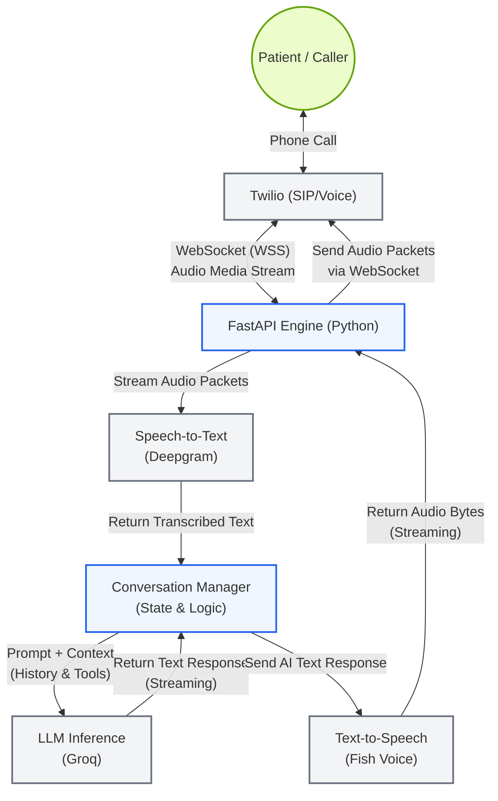

# Conversation Engine Flow

This flowchart illustrates the real-time AI Voice pipeline architecture using Twilio for telephony, Deepgram for Speech-to-Text, Groq for the LLM Brain, and Fish Voice for Text-to-Speech.

