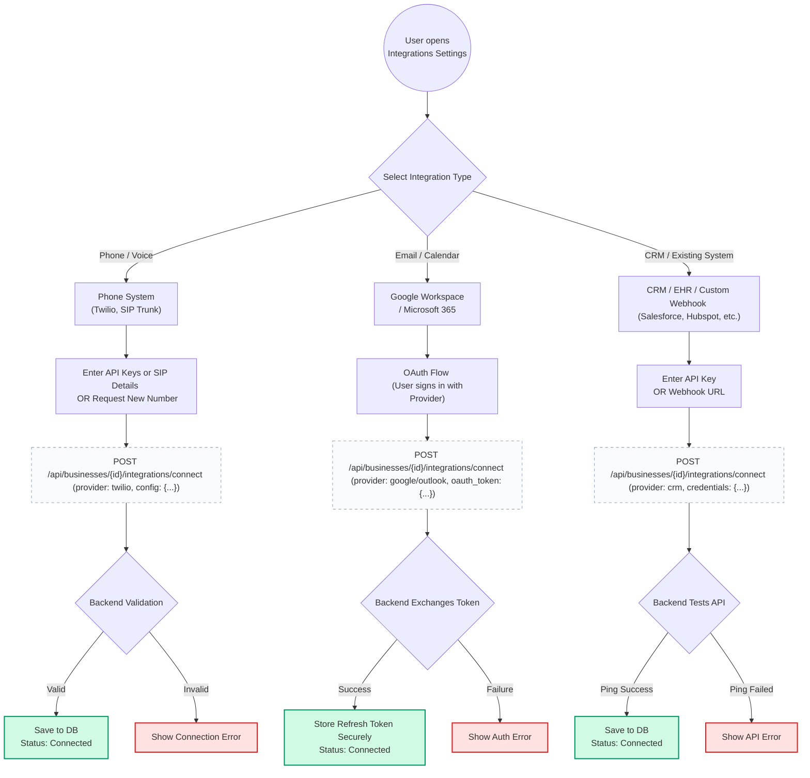

# Integrations Flow

This flowchart outlines the process for connecting various third-party services (Phone, Email, CRM) to the Amsh platform.

```mermaid
flowchart TD
    Start(("User opens \n Integrations Settings")) --> SelectType{"Select Integration Type"}
    
    %% Phone Integration Branch
    SelectType -->|Phone / Voice| Phone["Phone System\n(Twilio, SIP Trunk)"]
    Phone --> ConfigPhone["Enter API Keys or SIP Details \n OR Request New Number"]
    ConfigPhone --> ApiPhone["POST /api/businesses/{id}/integrations/connect \n(provider: twilio, config: {...})"]
    ApiPhone --> ValPhone{"Backend Validation"}
    ValPhone -->|Valid| SuccessPhone["Save to DB\nStatus: Connected"]
    ValPhone -->|Invalid| ErrorPhone["Show Connection Error"]
    
    %% Email / Calendar Integration Branch
    SelectType -->|Email / Calendar| Email["Google Workspace \n / Microsoft 365"]
    Email --> ConfigEmail["OAuth Flow \n (User signs in with Provider)"]
    ConfigEmail --> ApiEmail["POST /api/businesses/{id}/integrations/connect \n(provider: google/outlook, oauth_token: {...})"]
    ApiEmail --> ValEmail{"Backend Exchanges Token"}
    ValEmail -->|Success| SuccessEmail["Store Refresh Token Securely\nStatus: Connected"]
    ValEmail -->|Failure| ErrorEmail["Show Auth Error"]
    
    %% CRM Integration Branch
    SelectType -->|CRM / Existing System| CRM["CRM / EHR / Custom Webhook \n(Salesforce, Hubspot, etc.)"]
    CRM --> ConfigCRM["Enter API Key \n OR Webhook URL"]
    ConfigCRM --> ApiCRM["POST /api/businesses/{id}/integrations/connect \n(provider: crm, credentials: {...})"]
    ApiCRM --> ValCRM{"Backend Tests API"}
    ValCRM -->|Ping Success| SuccessCRM["Save to DB\nStatus: Connected"]
    ValCRM -->|Ping Failed| ErrorCRM["Show API Error"]
    
    %% Styling
    classDef step fill:#EFF6FF,stroke:#2563EB,stroke-width:2px;
    classDef endpoint fill:#F8FAFC,stroke:#94A3B8,stroke-width:1px,stroke-dasharray: 5 5;
    classDef success fill:#D1FAE5,stroke:#059669,stroke-width:2px;
    classDef error fill:#FEE2E2,stroke:#DC2626,stroke-width:2px;
    
    class ApiPhone,ApiEmail,ApiCRM endpoint;
    class SuccessPhone,SuccessEmail,SuccessCRM success;
    class ErrorPhone,ErrorEmail,ErrorCRM error;
```
