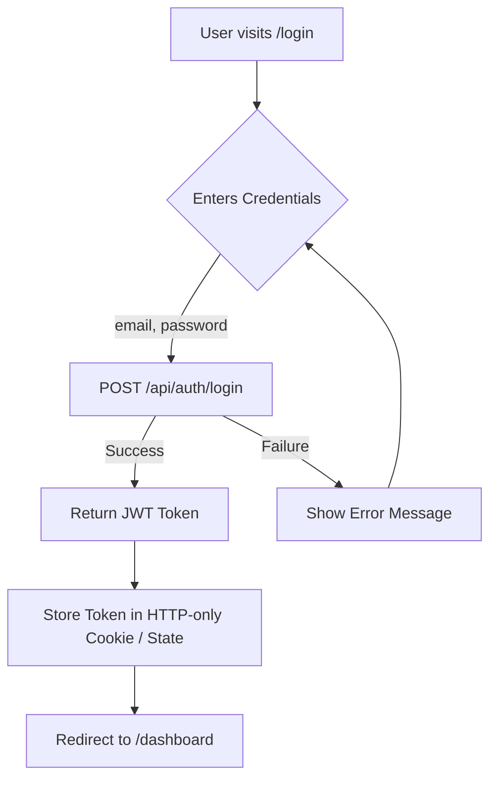

# Login & Auth Flow

```mermaid
flowchart TD
    A[User visits /login] --> B{Enters Credentials}
    B --> |email, password| C[POST /api/auth/login]
    
    C -->|Success| D[Return JWT Token]
    C -->|Failure| E[Show Error Message]
    
    D --> F[Store Token in HTTP-only Cookie / State]
    F --> G[Redirect to /dashboard]
    
    E --> B
```
