# Onboarding Process (Frontend to Backend)

This outlines the step-by-step onboarding wizard for a new business, matching the `frontend/user/app/onboarding` directories and the FastAPI backend endpoints.

```mermaid
flowchart TD
    %% Initial Registration
    Start(("Start")) --> Reg["User Registration"]
    Reg -- "POST /api/auth/register \n(email, password, name)" --> Login["Auto-Login / Get JWT"]
    
    %% Step 1: Business
    Login --> Step1["Step 1: Business Details\n /onboarding/business"]
    Step1 -- "POST /api/businesses \n(name, business_type, country)" --> Step2
    
    %% Step 2: Services
    Step2["Step 2: Services\n /onboarding/services"]
    Step2 -- "POST /api/businesses/{id}/services \n(title, description, duration, price)" --> Step3
    
    %% Step 3: Staff
    Step3["Step 3: Staff & Team\n /onboarding/staff"]
    Step3 -- "POST /api/businesses/{id}/staff \n(name, role, specialty, email)" --> Step4
    
    %% Step 4: Hours
    Step4["Step 4: Working Hours\n /onboarding/hours"]
    Step4 -- "PATCH /api/businesses/{id} \n(working_hours JSON)" --> Step5
    
    %% Step 5: AI Receptionist
    Step5["Step 5: AI Config\n /onboarding/ai-receptionist"]
    Step5 -- "POST /api/businesses/{id}/agents \n(name, voice_model, language, personality)" --> Step6
    
    %% Step 6: Knowledge Base
    Step6["Step 6: Knowledge\n /onboarding/knowledge"]
    Step6 -- "POST /api/businesses/{id}/knowledge \n(doc_type [faq|website|doc], question, answer, source_url)" --> Step7
    
    %% Step 7: Integrations
    Step7["Step 7: Integrations\n /onboarding/integrations"]
    Step7 -- "POST /api/businesses/{id}/integrations/connect \n(provider: twilio/google, config JSON)" --> Step8
    
    %% Step 8: Review
    Step8["Step 8: Review\n /onboarding/review"]
    Step8 -- "Confirm All Data" --> Step9
    
    %% Step 9: Success
    Step9["Step 9: Success\n /onboarding/success"]
    Step9 --> Finish(("Go to Dashboard"))
    
    %% Styling
    classDef step fill:#EFF6FF,stroke:#2563EB,stroke-width:2px;
    classDef endpoint fill:#F8FAFC,stroke:#94A3B8,stroke-width:1px,stroke-dasharray: 5 5;
    
    class Step1,Step2,Step3,Step4,Step5,Step6,Step7,Step8,Step9 step;
```

