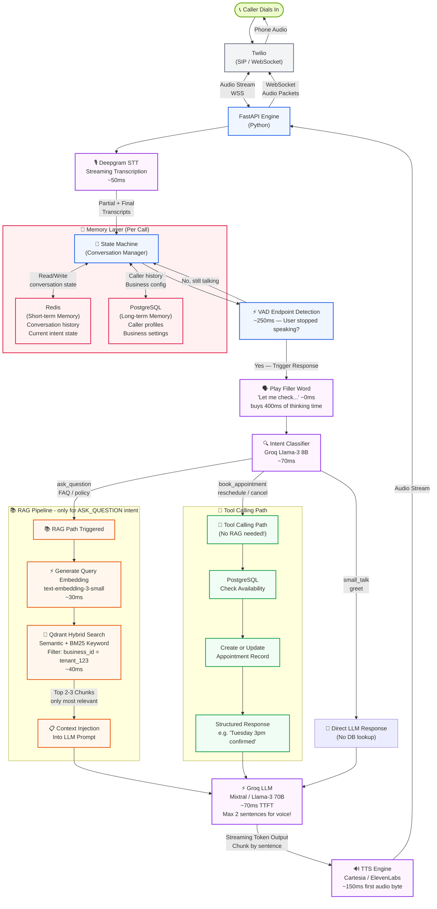
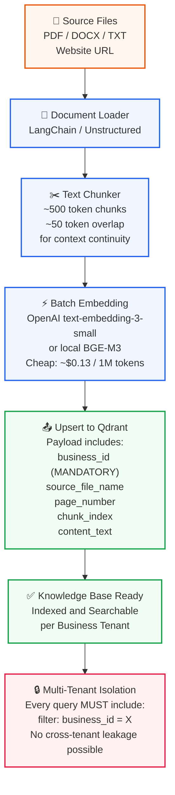

# 🧠 Amsh AI Receptionist — Complete RAG Architecture

> **Target Latency:** < 800ms end-to-end (perceived ~250ms with filler word trick)

---

## 📌 Recommended RAG Stack

| Layer | Technology | Why |
|---|---|---|
| **Voice Gateway** | Twilio WebSocket | Low-latency media streaming |
| **STT** | Deepgram (`nova-2`) | Streaming partial transcripts, ~50ms |
| **Intent Classifier** | Groq (Llama-3 8B) | Ultra-fast classification, ~70ms |
| **Embeddings** | `text-embedding-3-small` (OpenAI) or BGE-M3 (local) | Fast, cheap, high quality |
| **Vector DB** | **Qdrant** (self-host) | Hybrid search + metadata filtering natively |
| **LLM Generation** | Groq (Llama-3 70B or Mixtral) | Fastest LPU inference |
| **TTS** | Cartesia / ElevenLabs | First audio byte in ~150ms |
| **Short-term Memory** | Redis | Per-call conversation state |
| **Long-term DB** | PostgreSQL | Caller history, business config |

---

## 🔄 FULL CALL FLOW — Real-Time Voice + RAG Pipeline



---

## 📥 OFFLINE INGESTION PIPELINE (Knowledge Base Builder)

> **When:** Business owner uploads PDF, DOCX, or syncs a website URL.



---

## ⚡ LATENCY BREAKDOWN (Optimized Pipeline)

| Stage | Time | Notes |
|---|---|---|
| VAD Endpoint Detection | ~250ms | User finished speaking |
| STT Final Transcript | ~50ms | Deepgram nova-2 streaming |
| Intent Classification | ~70ms | Groq Llama-3 8B (fast model) |
| **[RAG] Query Embedding** | ~30ms | Small embedding model |
| **[RAG] Qdrant Hybrid Search** | ~40ms | Pre-filtered by business_id |
| LLM TTFT (Groq) | ~70ms | First token from Mixtral/Llama-3 70B |
| TTS First Audio Byte | ~150ms | Cartesia streaming |
| Network (colocated) | ~80ms | Same AZ as Twilio edge |
| **Total True Latency** | **~600ms** | End-to-end |
| **Perceived Latency** | **~250ms** | With filler word trick |

---

## 🏗️ Backend Module Map

```
backend/
├── engine/
│   ├── conversation/   ← State machine, turn management
│   ├── orchestration/  ← Coordinates STT → Intent → RAG/Tool → TTS
│   ├── guardrails/     ← PII masking, out-of-scope detection
│   └── prompts/        ← System prompt templates per vertical
│
├── rag/
│   ├── ingestion/      ← PDF/web loader, chunker
│   ├── embeddings/     ← Embedding model wrapper
│   ├── vector_store/   ← Qdrant client with business_id filter
│   └── retrieval/      ← Hybrid search, context builder
│
├── speech/             ← Deepgram STT, TTS (Cartesia/ElevenLabs)
├── llm/                ← Groq client, prompt builder
├── memory/             ← Redis (short-term), PG (long-term)
├── tools/              ← Appointment booking, calendar, etc.
├── verticals/          ← clinic.yaml, restaurant.yaml configs
└── integrations/       ← Twilio, third-party APIs
```

---

## 🔑 Key Design Rules

> [!IMPORTANT]
> **Multi-Tenancy:** `business_id` MUST be passed as a hard filter in every single Qdrant query. Never search across all vectors.

> [!IMPORTANT]
> **Intent Routing:** RAG is ONLY triggered for `ask_question` intent. Booking/rescheduling goes straight to Tool Calling. This saves 100-200ms on most calls.

> [!TIP]
> **Voice-Optimized Prompt:** Always add to LLM system prompt: *"Answer in max 2 short sentences. This is for voice playback — never use bullet points or markdown."*

> [!TIP]
> **Filler Words:** The instant VAD detects silence, play a pre-recorded filler word while the pipeline processes in background. This makes perceived latency feel like ~250ms instead of ~600ms.

> [!WARNING]
> **Chunk Size:** Keep chunks at ~500 tokens with 50-token overlap. Too small = loses context. Too large = wastes LLM context window and increases latency.
